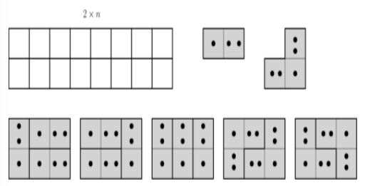

## [DP] Tiling with I and L dominoes
--------------

- **```2xn```** 판을 I자 모양 도미노와 L자 모양 도미노로 채우는 경우의 수를 계산해 출력한다
    - 두 가지 모양의 도미노는 충분히 많아서 원하는 만큼 사용할 수 있다고 가정
    - 도미노를 원하는 각도 (90, 180, 270)로 회전하고 상하좌우 대칭을 자유롭게 해서 배치 가능
- **입력**: n   # ```2xn``` 판을 의미
- **출력**: 두 가지 모양의 도미노로 채울 수 있는 경우의 수 (자연수)
- **분석**: 코드 마지막 부분에 주석으로 본인이 세운 점화식을 쓰고 간략히 설명할 것
- **예**: 아래 그림은 2x3 판을 채우는 다섯가지 경우를 나타낸다
- **힌트1**: 가장 오른쪽에 도미노를 배치하고 그 왼쪽 부분에 대한 경우의 수를 DP 테이블의 값으로 표현해서 DP 점화식을 세워본다
- **힌트2**: DP 테이블이 2개 필요하다




### 에시 1
입력
```
2
```
출력
```
2
```
<br/>

### 에시 2
입력
```
3
```
출력
```
5
```
<br/>

### 에시 3
입력
```
4
```
출력
```
11
```
<br/>
