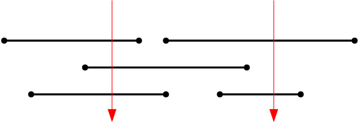

## [Greedy] Pinning 문제
---
- 아래 그림처럼 <code>n</code>개의 막대가 입력으로 주어질 때, <code>n</code>개의 막대를 최소 개수의 핀(pin)으로 꽂으려 한다. 모든 막대는 최소 하나 이상의 못이 박혀야 한다. 이 때, 필요한 핀의 최소 개수는 몇 개일까?
    - 아래 그림에서는 2개의 핀으로 모두 꽂을 수 있다
    - 핀이 막대의 끝을 통과하더라도 꽂은 것으로 한다




- **입력**: 첫 줄에는 값 `n`이 주어진다. `n`은 1 이상 500,000 (오십만) 범위이다. 둘째 줄부터 n개의 구간의 왼쪽 끝 점 ```a```와 오른쪽 끝 점` b`의 좌표 값이 차례대로 주어진다. 이 두 값의 범위는 0 이상 200,000 이하이며, 항상 `a <= b` 임에 유의하자.

- **출력**: <u>**최소 핀의 수**</u>
- **주석**: 자신의 알고리즘을 간략히 설명하고, 수행시간을 분석하세요.


### 에시1
입력
```
10
19 19
1 11
19 20
16 17
2 11
2 2
18 18
3 16
1 11
8 8
```
출력
```
5
```

### 에시2
입력
```
5
7 7
3 4
0 10
2 5
3 5
```
출력
```
2
```
